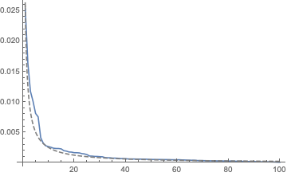
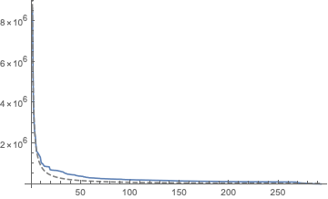
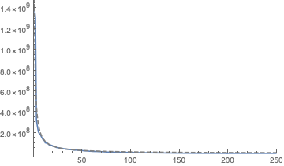
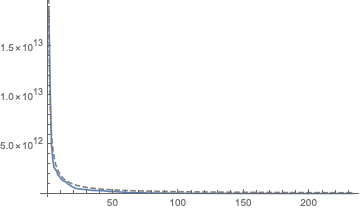

# Applications of Zipf's Law Beyond Language
_*From populations distribution to galaxy densities, Zipf's Law holds for much more than language*_

Natasha Dada, Jun. 24,  2018 

## An Introduction to Zipf's Law
Zipf's Law is an empirical law that states that the frequency ranks and the frequencies of words in spoken languages are inversely related. This means that in any language, the frequency of the most frequent word will be approximately twice the frequency of the second most frequent word, three times the frequency of the third most frequent word, etc. In other words, the most frequent word will occur approximately twice as often as the second most frequent word, three times as often as the third most frequent word, etc. Since its discovery, Zipf's Law has proven to describe a range of phenomena, some relating to language and many from a variety of other fields. The law applies to letter frequencies in addition to word frequencies in languages, population distributions, income and wealth distributions, cooperation sizes, TV channel viewings, the relative abundances of expressed genes, densities of galaxies, and much more. This essay aims to explore and illustrate Zipf's Law as applied to languages as well as applications in population distribution and wealth distribution.

## Zipf's Law in Language
The following section will demonstrate Zipf's Law as applied to language. It is important to note that though English is used as an example, Zipf's law applies to all languages and all alphabets, even constructed languages such as Esperanto.

### Zipf's Law in English
In order to demonstrate Zipf's Law in English, we can start with a list of English Words.

A list of English words:

    WordList[]

    {"a", "aah", "aardvark", "aback", "abacus", "abaft", "abalone", 
    "abandon", "abandoned", "abandonment", "abase", "abasement", "abash", 
    "abashed", "abashment", "abate", "abatement", "abattoir", "abbe", 
    "abbess", ..., "zloty", "zodiac", "zodiacal", "zombie", "zonal", 
    "zone", "zoning", "zoo", "zoological", "zoologist", "zoology", "zoom", 
    "zoophyte", "zounds", "zucchini", "zwieback", "zydeco", "zygote", 
    "zygotic", "zymurgy"}

We can then get the frequency of the one hundred most common words, sorted from most frequent to least frequent. These frequency values are based on the English Corpus and the frequency is the frequency of a word in a typical published English text. The one hundred most frequent English words is taken from an online dataset cited at the end of the essay.

The one hundred most frequently used English words and their frequencies

    mostFrequentWords = 
    WordFrequencyData[{"the", "be", "to", "of", "and", "a", "in", 
    "that", "have", "I", "it", "for", "not", "on", "with", "he", "as",
    "you", "do", "at", "this", "but", "his", "by", "from", "they", 
    "we", "say", "her", "she", "or", "an", "will", "my", "one", "all",
    "would", "there", "their", "what", "so", "up", "out", "if", 
    "about", "who", "get", "which", "go", "me", "when", "make", "can",
    "like", "time", "no", "just", "him", "know", "take", "people", 
    "into", "year", "your", "good", "some", "could", "them", "see", 
    "other", "than", "then", "now", "look", "only", "come", "its", 
    "over", "think", "also", "back", "after", "use", "two", "how", 
    "our", "work", "first", "well", "way", "even", "new", "want", 
    "because", "any", "these", "give", "day", "most", "us"}];
    
The one hundred most frequently used English words sorted by frequency

    mostFrequentWords = Sort[mostFrequentWords, Greater];
    
From here, we can already see Zipf's Law. The most frequent English word "the" occurs approximately twice as often as the second most frequent English word "of". Though the ratio between the frequencies is not exactly 2, an inverse relationship becomes clearer farther down the list.
    
Comparing the frequency of the two most common English words:

    mostFrequentWords[[1]]/mostFrequentWords[[2]]

    1.54399
    
Additionally, we can compare "the" to the third most frequent word "and". Here, we get a ratio of approximately 2, not 3, however, there is still an inverse relationship. If we look farther down the list of words, we see that after the first few words the relationship between frequency and rank is closely proportional to the function 1/x.

Comparing the frequency of the most common and third most common English words:

    mostFrequentWords[[1]]/mostFrequentWords[[3]]

    2.14942
    
"The" is approximately ten times as frequent as the tenth most frequent word "with". Though the first few words were not exactly proportional to the curve 1/x, by the tenth word the data fit this function.

Comparing the frequency of the most common and tenth most common English words:

    mostFrequentWords[[1]]/mostFrequentWords[[10]]

    9.45936

To show the inverse relationship between frequency rank and frequency, we can create a plot with the one hundred most frequent words, with rank on the x-axis and frequency on the y-axis. We can also plot a curve proportional to 1/x to better illustrate the inverse relationship.

A plot of frequency vs. rank for the one hundred most common English words and a curve proportional to 1/x:

    Show[
	      ListLinePlot[mostFrequentWords, LabelingFunction->False, PlotRange->All],
	      Plot[mostFrequentWords[[1]]/x, {x, 0, 100}, PlotStyle->{Gray, Dashed}, PlotRange->All]
    ]

The above example illustrated Zipf's Law as it was discovered in language. The next sections will explore applications of Zipf's Law in other fields.

## Zipf's Law and Population Distribution

Now that we've seen how Zipf's Law works in language, we can look at its application to other phenomena. One such phenomenon is city populations in each country. Just as frequency rank and frequency of words are inversely related in language, the population rank and population of cities in any country is also inversely related, following Zipf's law. This means that the most populous city in any country has approximately twice the population of the second most populous city, three times the population of the third most populous city, etc. In this section, we will demonstrate this law by looking at data from the United States. It is important to note that the United States is only an example and Zipf's Law applies to the population distribution of all countries.

### Zipf's Law and City Populations in the United States

To demonstrate Zipf's Law in city populations in the United States, we can start with a list of the most populous US cities.

A list of cities in the US:

    cities = 
    {"New York", "Los Angeles", "Chicago", "Houston", "Phoenix", "Philadelphia", "San Antonio", "San Diego", "Dallas", "San Jose", 
    "Austin", "Jacksonville", "San Francisco", "Fort Worth", "Indianapolis", "Charlotte", "Seattle", "Denver", "Washington", 
    "Boston", "El Paso", "Detroit", "Nashville", "Memphis", "Portland", "Oklahoma City", "Las Vegas", "Louisville", "Baltimore", 
    "Milwaukee", "Albuquerque", "Tucson", "Fresno", "Sacramento", "Mesa", "Atlanta", "Long Beach", "Omaha", "Raleigh", 
    "Colorado Springs", "Miami", "Virginia Beach", "Oakland", "Minneapolis", "Tulsa", "Arlington", "New Orleans", "Wichita", 
    "Cleveland", "Tampa", "Bakersfield", "Anaheim", "Honolulu", "Santa Ana", "Riverside", "Corpus Christi", "Lexington", 
    "Stockton", "St. Louis", "Saint Paul", "Henderson", "Pittsburgh", "Cincinnati", "Anchorage", "Greensboro", "Plano", "Newark", 
    "Lincoln", "Orlando", "Irvine", "Toledo", "Jersey City", "Chula Vista", "Durham", "Fort Wayne", "Laredo", "Buffalo", 
    "Madison", "Lubbock", "Chandler", "Scottsdale", "Reno", "Norfolk", "Winston-Salem", "North Las Vegas", "Gilbert", "Chesapeake", 
    "Irving", "Hialeah", "Garland", "Fremont", "Boise", "Baton Rouge", "Des Moines", "Spokane", "San Bernardino", "Modesto", "Tacoma", 
    "Fontana", "Santa Clarita", "Birmingham", "Oxnard", "Fayetteville", "Moreno Valley", "Glendale", "Yonkers", "Huntington Beach", 
    "Aurora", "Salt Lake City", "Amarillo", "Montgomery", "Grand Rapids", "Little Rock", "Akron", "Augusta", "Huntsville", 
    "Columbus", "Grand Prairie", "Shreveport", "Overland Park", "Tallahassee", "Mobile", "Port St. Lucie", "Knoxville", 
    "Worcester", "Tempe", "Cape Coral", "Brownsville", "McKinney", "Providence", "Fort Lauderdale", "Newport News", "Chattanooga", 
    "Rancho Cucamonga", "Frisco", "Sioux Falls", "Oceanside", "Ontario", "Vancouver", "Santa Rosa", "Garden Grove", "Elk Grove", 
    "Pembroke Pines", "Salem", "Eugene", "Corona", "Jackson", "Cary", "Fort Collins", "Hayward", "Lancaster", "Salinas", "Palmdale", 
    "Sunnyvale", "Hollywood", "Clarksville", "Pomona", "Kansas City", "Macon", "Escondido", "Paterson", "Joliet", "Naperville", 
    "Rockford", "Torrance", "Bridgeport", "Savannah", "Killeen", "Bellevue", "Mesquite", "Syracuse", "McAllen", "Pasadena", 
    "Orange", "Fullerton", "Dayton", "Miramar", "Olathe", "Thornton", "Waco", "Murfreesboro", "Denton", "West Valley City", "Midland", 
    "Carrollton", "Roseville", "Warren", "Charleston", "Hampton", "Surprise", "Coral Springs", "Visalia", "Sterling Heights", 
    "Gainesville", "Cedar Rapids", "New Haven", "Stamford", "Elizabeth", "Concord", "Thousand Oaks", "Kent", "Santa Clara", 
    "Simi Valley", "Lafayette", "Topeka", "Athens", "Round Rock", "Hartford", "Norman", "Victorville", "Fargo", "Berkeley", 
    "Vallejo", "Abilene", "Columbia", "Ann Arbor", "Allentown", "Pearland", "Beaumont", "Wilmington", "Evansville", "Arvada", 
    "Provo", "Independence", "Lansing", "Odessa", "Richardson", "Fairfield", "El Monte", "Rochester", "Clearwater", "Carlsbad", 
    "Springfield", "Temecula", "West Jordan", "Costa Mesa", "Miami Gardens", "Cambridge", "College Station", "Murrieta", 
    "Downey", "Peoria", "Westminster", "Elgin", "Antioch", "Palm Bay", "High Point", "Lowell", "Manchester", "Pueblo", "Gresham", 
    "North Charleston", "Ventura", "Inglewood", "Pompano Beach", "Centennial", "West Palm Beach", "Everett", "Richmond", "Clovis", 
    "Billings", "Waterbury", "Broken Arrow", "Lakeland", "West Covina","Boulder", "Daly City", "Santa Maria", "Hillsboro", 
    "Sandy Springs", "Norwalk", "Lewisville", "Greeley", "Davie", "Green Bay", "Tyler", "League City", "Burbank", "San Mateo", 
    "Wichita Falls", "El Cajon", "Rialto", "Lakewood", "Edison", "Davenport", "South Bend", "Woodbridge", "Las Cruces", "Renton", 
    "Sparks", "Clinton", "Allen", "Tuscaloosa", "San Angelo", "Vacaville"};

We can then get the population of each of these cities and sort this list by population from most populous to least populous.

A list of US cities and their populations

    cityPopulations = EntityValue[Interpreter["City"][cities], "Population", "EntityPropertyAssociation"];

A list of US cities sorted by population

    cityPopulations = Sort[cityPopulations, Greater];
    
By comparing the first few results, we can already see that Zipf's Law applies. The most populous city in the United States, New York City, has approximately twice the population of the second most populous city, Los Angeles.

Comparing the populations of the two most populous US cities:

    cityPopulations[[1]]/cityPopulations[[2]] // N

    2.14713
    
We can also compare the population of the most populous city, New York, to the population of the third most populous city, Chicago, and we get a ratio of approximately 3, aligning with Zipf's Law.

Comparing the populations of the most populous and third most populous US cities:

    cityPopulations[[1]]/cityPopulations[[3]] // N

    
    3.17425

We can do the same comparison with the most and tenth most populous cities, New York City and San Diego respectively, getting a ratio of approximately 10. Though this ratio is not exactly 10, an inverse relationship is still clear.

Comparing the populations of the most populous and tenth most populous US cities:

    cityPopulations[[1]]/cityPopulations[[10]] // N

    8.32659
    
From here we can illustrate this inverse relationship with a graph of population vs. population rank along with a curve proportional to 1/x.

A plot of population vs. population rank for US cities and a curve proportional to 1/x:

    Show[
	      ListLinePlot[cityPopulations, LabelingFunction->False, PlotRange->All],
	      Plot[QuantityMagnitude[cityPopulations[[1]]]/x, {x, 0, Length[cityPopulations]}, PlotStyle->{Gray, Dashed}, PlotRange->All]
    ]
    

### Zipf's Law and World Population Distribution

Zipf's Law applies to cities within each country, but it also applies to world populations. That is, the population and population rank of all the countries in the world are inversely related. To illustrate this, we can start with a list of countries.

A list of countries:
    
    countries = EntityList[EntityClass["Country", "Countries"]];
    
We can then get the population of each country and sort this list by population size, from most populous to least populous.

A list of countries and their populations:

    countriesPopulations = EntityValue[countries, "Population", "EntityPropertyAssociation"];

A list of countries sorted by population:
    
    countriesPopulations = Sort[countriesPopulations, Greater];
    
We can now plot population vs. population rank along with a curve proportional to 1/x to illustrate the inverse relationship between the two.

A plot of population vs. rank and a curve proportional to 1/x:

    Show[
	      ListLinePlot[countriesPopulations, LabelingFunction->False, PlotRange->All],
	      Plot[QuantityMagnitude[countriesPopulations[[1]]]/x, {x,0,Length[countriesPopulations]}, PlotStyle->{Gray, Dashed}, PlotRange->All]
    ]

### Zipf's Law and Population: Conclusion
The examples in this section have helped to illustrate that within all countries, regardless of population size, as well as countries' relative populations follow a population distribution aligned with Zipf's Law. This is an incredible application of Zipf's Law and can help us to better understand the nature of populations.

## Zipf's Law and World Wealth Distribution
Another application of Zipf's Law is wealth distribution. This means that in a corporation, for example, the person who makes the most makes twice as much as the person who makes the second most, three times as much as the person who makes the third most, etc. Zipf's Law holds for almost all wealth distributions, from the net worths of individuals to incomes of countries. In this section, we will explore world wealth distribution, using Gross Domestic Products (GDPs) of countries.

We start with a list of countries in the world.

A list of countries:
    
    countries = EntityList[EntityClass["Country", "Countries"]];
    
We now look at the GDP of each country and sort from highest to lowest GDP. Countries with missing data have been excluded.

A list of countries and their GDPs:

    countriesGDPs = DeleteMissing[EntityValue[countries, "GDP", "EntityPropertyAssociation"]];

A list of countries sorted by GDP:

    countriesGDPs = Sort[countriesGDPs, Greater];
    
By comparing individual entries, we can see the inverse relationship. Comparing the highest GDP (United States) to the second highest GDP (China) yields a ratio of approximately 2.

A comparison of the two highest GDPs:
    
    countriesGDPs[[1]]/countriesGDPs[[2]]

    1.66303

Comparing the GDP of the United States with the tenth highest GDP (Canada) yields a ratio of approximately 10.

A comparison of the highest and tenth highest GDPs:

    countriesGDPs[[1]]/countriesGDPs[[10]]

    12.1748

We can now plot GDP vs. rank along with a curve proportional to 1/x to illustrate an inverse relationship between the two. 

A plot of GDP vs. rank for all countries with a curve proportional to 1/x:

    Show[
	      ListLinePlot[countriesGDPs, LabelingFunction->False, PlotRange->All],
	      Plot[QuantityMagnitude[countriesGDPs[[1]]/x], {x, 0, Length[countriesGDPs]}, PlotStyle->{Gray,Dashed}, PlotRange->All]
    ]

### Zipf's Law and Wealth Distribution: Conclusion
Applying Zipf's Law to wealth distribution has many implications. For instance, it helps explain why the top 1% of the world population has half of total world wealth and why wealth gaps around the world continue to grow. Though this section explored only one instance of Zipf's Law in wealth distribution, Zipf's Law has big implications in this field.

## Conclusion
Zipf's Law is significant because it allows us to explore and better understand many phenomena not just individually, but also in relation to each other. The implications of Zipf's Law are often incredibly powerful and far reaching. Though this essay explored only few of the many applications of Zipf's Law, it is a starting point for how we can illustrate and understand Zipf's Law.

## Further Explorations
**Related Laws**: Benford's Law, the Pareto Principle, the Yule-Simon distribution, Price's Law, Bradford's Law, Gibrat's Law, Heap's Law

**Further applications of Zipf's Law**: Income distributions, cooperation sizes, TV channel viewings, the relative abundances of expressed genes, densities of galaxies

**Zipf's Law Over Time**: Explore how Zipf's Law has holds during periods of change. In times of population change, for example, illustrate how despite a decline in overall population, the relative distribution of populations is maintained, following Zipf's Law.

## Consulted Sources and Further Reading
* https://en.wikipedia.org/wiki/Zipf%27s_law
* https://www.britannica.com/topic/Zipfs-law
* https://io9.gizmodo.com/the-mysterious-law-that-governs-the-size-of-your-city-1479244159
* https://www.technologyreview.com/s/534251/astrophysicists-prove-that-cities-on-earth-grow-in-the-same-way-as-galaxies-in-space/
* https://www.ncbi.nlm.nih.gov/pubmed/12633463
* https://www.theguardian.com/commentisfree/2011/nov/11/occupy-movement-wealth-power-law-distribution
* https://en.wikipedia.org/wiki/Most_common_words_in_English
* https://en.wikipedia.org/wiki/List_of_United_States_cities_by_population

